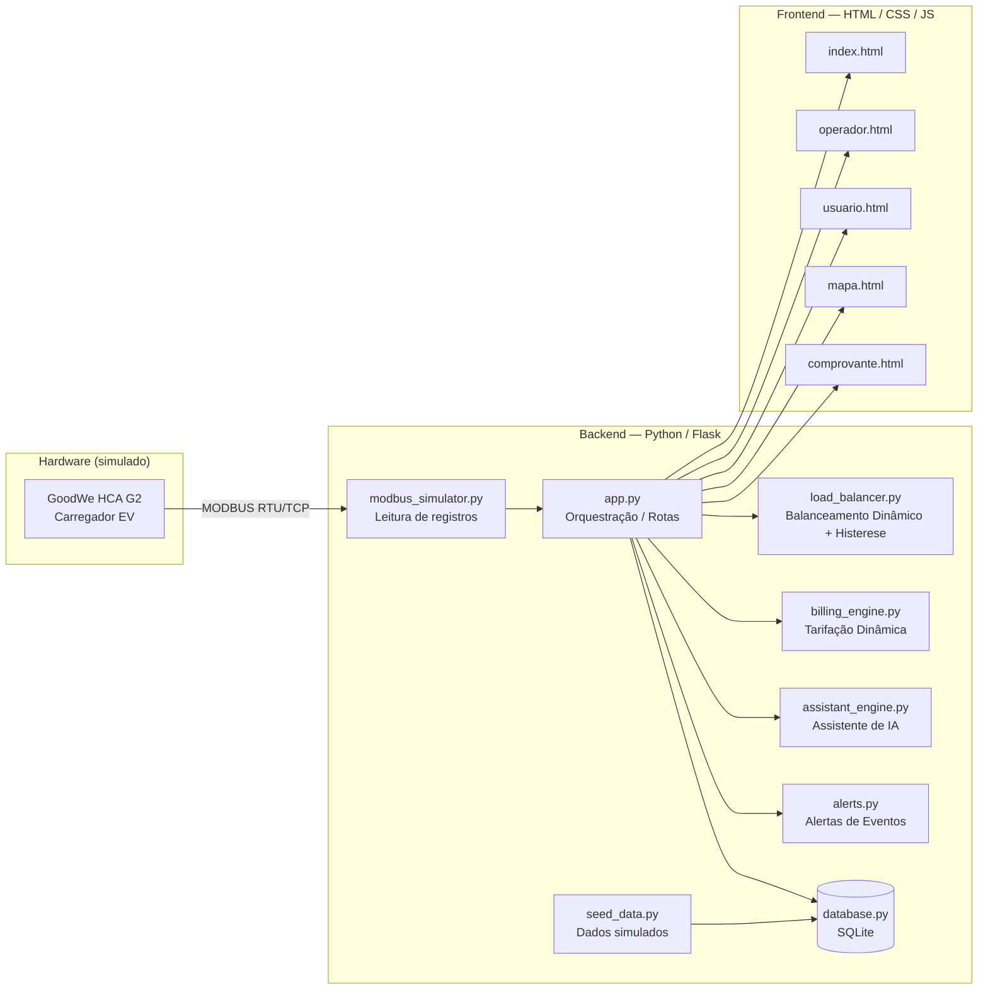

# ChargeGrid Intelligence Hub

**Powered by GoodWe HCA G2** · EV Challenge 2026 — Equipe 03

Sistema de gestão inteligente para eletropostos comerciais, desenvolvido como camada de software sobre o carregador GoodWe HCA G2 (protocolo MODBUS). O projeto integra leitura de dados em tempo real, balanceamento dinâmico de carga, faturamento dinâmico por horário e um assistente de IA, conectando a operação do eletroposto à geração de receita e à experiência do usuário final.

---

## Equipe

| Integrante | RM |
| --- | --- |
| Wendel Pedro | 573126 |
| Daniel Alejandro | 573075 |
| Arthur Araújo | 573308 |
| Victor Hugo Lavaqui | 573838 |

---

## Sumário

- [Sobre o projeto](#sobre-o-projeto)
- [Esquema de integração dos componentes](#esquema-de-integração-dos-componentes)
- [Justificativa técnica das escolhas](#justificativa-técnica-das-escolhas)
- [Telas do sistema](#telas-do-sistema)
- [Resultados e dados funcionais](#resultados-e-dados-funcionais)
- [Conexão com os conteúdos da disciplina](#conexão-com-os-conteúdos-da-disciplina)
- [Tecnologias utilizadas](#tecnologias-utilizadas)
- [Como executar o projeto](#como-executar-o-projeto)

---

## Sobre o projeto

O **ChargeGrid Intelligence Hub** ataca um problema concreto da transição de eletropostos residenciais para comerciais: a ausência de mecanismos integrados de controle de demanda, cobrança automatizada e comunicação clara com o usuário. A solução simula a leitura de um carregador real (GoodWe HCA G2) via protocolo MODBUS e, a partir desses dados, automatiza decisões que normalmente dependeriam de operação manual — como reduzir potência antes de ultrapassar o limite contratado ou calcular a tarifa correta de cada sessão de recarga.

---

## Esquema de integração dos componentes



**Fluxo resumido:** o `modbus_simulator.py` simula a leitura de potência, tensão, corrente e energia acumulada do carregador GoodWe HCA G2 → `app.py` recebe esses dados e os distribui para os módulos de negócio → `load_balancer.py` decide se é necessário reduzir potência (evitando ultrapassar o limite contratado), `billing_engine.py` calcula o custo da sessão conforme a tarifa vigente, `assistant_engine.py` responde dúvidas do usuário e `alerts.py` dispara notificações de eventos (ex.: falha de conector) → tudo é persistido via `database.py` (SQLite) e exibido nos templates do frontend.

---

## Justificativa técnica das escolhas

- **Python + Flask**: permitiu prototipar rapidamente múltiplos módulos de regra de negócio (balanceamento, tarifação, IA, alertas) desacoplados, mantendo o código legível e fácil de testar isoladamente — essencial em um projeto com prazo curto e vários integrantes.
- **SQLite**: banco leve, sem necessidade de servidor externo, adequado ao escopo de um protótipo funcional que precisa rodar em qualquer máquina sem infraestrutura adicional.
- **Simulação via MODBUS**: em vez de mockar valores aleatórios, o `modbus_simulator.py` respeita a lógica de registros do mapa MODBUS real do GoodWe HCA G2, garantindo que a lógica de leitura seja compatível com o hardware físico caso o sistema seja integrado futuramente.
- **Balanceamento com histerese**: o `load_balancer.py` não reage a cada pequena variação de potência — foi implementada uma margem de segurança (histerese) e um tempo mínimo entre transições, evitando oscilações (ligar/desligar redução repetidamente), problema comum em sistemas de controle reativo simples.
- **Tarifação por faixas de horário**: a cobrança dinâmica (fora de ponta, normal, pico, reduzido) foi escolhida por refletir o comportamento real de tarifas de energia comercial, permitindo à IA sugerir incentivos para horários de menor demanda.

---

## Telas do sistema

> As imagens abaixo devem ser salvas na pasta `docs/screenshots/` do repositório, com os nomes indicados, para renderizar corretamente no GitHub.

**Landing page**
`docs/screenshots/landing.png`
Visão inicial do sistema, com atalhos para os três painéis (Operador, Usuário, Mapa) e QR code de acesso mobile.

**Painel do Operador — Conectores**
`docs/screenshots/painel-operador-conectores.png`
Demanda elétrica em tempo real, indicador de balanceamento ativo, status de cada conector e tarifas configuradas.

**Painel do Operador — Faturamento**
`docs/screenshots/painel-operador-faturamento.png`
Receita do dia, total de sessões, ticket médio, histórico de sessões e exportação em CSV.

**Painel do Operador — IA**
`docs/screenshots/painel-operador-ia.png`
Recomendações automáticas do motor de IA (ex.: identificação de conector em falha).

**Painel do Operador — Configurações**
`docs/screenshots/painel-operador-config.png`
Configuração do limite contratado de potência e das tarifas por horário.

**Painel do Usuário**
`docs/screenshots/painel-usuario.png`
Progresso da sessão ativa, custo acumulado, tarifa vigente e chat de suporte via IA.

**Mapa de Conectores**
`docs/screenshots/mapa-conectores.png`
Visão espacial da planta do estacionamento, com status de cada conector.

---

## Resultados e dados funcionais

O protótipo roda com dados simulados que demonstram um cenário realista de operação comercial:

- **4 de 6 conectores ativos**, com potência total de **42,6–42,8 kW** sobre um limite contratado de **55 kW** (≈77,5% de demanda).
- **Balanceamento dinâmico ativo**, sinalizado ao operador antes de qualquer risco de ultrapassagem do limite.
- **12 sessões encerradas no dia**, receita de **R$210,76** e ticket médio de **R$17,56**.
- **4 faixas de tarifação configuradas**: fora de ponta (R$0,62), normal (R$0,78), pico (R$1,25) e reduzido (R$0,70).
- **Assistente de IA** respondendo dúvidas do usuário em tempo real durante a sessão.
- **Alertas automáticos** de falha de conector, com indicação do registro MODBUS envolvido.

Durante o desenvolvimento, os seguintes problemas técnicos foram identificados e corrigidos, evidenciando o processo de depuração e amadurecimento do sistema:

| Problema | Causa | Correção |
| --- | --- | --- |
| Falha no acúmulo de kWh | Truncamento de inteiro no simulador MODBUS | Ajuste de tipo de dado para ponto flutuante |
| Oscilação do balanceador de carga | Ausência de histerese | Implementação de margem de segurança e tempo mínimo entre transições |
| Sessões não persistidas | Sessão não era gravada no banco ao iniciar | Escrita no banco movida para o início da sessão |
| Conector não liberado após encerramento | Estado não era resetado corretamente | Correção do fluxo de encerramento de sessão |
| QR Code inacessível por outros dispositivos | QR Code apontava para `localhost` | QR Code passou a ser gerado com o IP da rede local |

---

## Conexão com os conteúdos da disciplina

O desenvolvimento aplicou diretamente os pilares do Pensamento Computacional:

- **Decomposição**: o problema foi dividido em módulos independentes (leitura de dados, balanceamento, tarifação, IA, alertas), cada um testável isoladamente.
- **Reconhecimento de padrões**: o histórico de sessões simulado permite identificar horários de pico e padrões de consumo, base para as recomendações do motor de IA.
- **Abstração**: cada tela expõe apenas o que é relevante para seu público — o operador vê receita e potência agregada; o usuário final vê apenas custo, tempo e progresso da carga, sem dados técnicos como tensão ou corrente.
- **Construção estruturada de soluções (algoritmos)**: cada módulo segue o padrão entrada → processamento → saída (ex.: leitura MODBUS → cálculo de tarifa → cobrança), característica central da automação com Python aplicada neste projeto.

Do ponto de vista de energias renováveis e sustentáveis, o balanceamento dinâmico de carga contribui diretamente para o uso mais eficiente da energia disponível, evitando desperdício por sobredimensionamento de potência e reduzindo o risco de penalidades por demanda excedente — o que também favorece a viabilidade de expansão da frota de carregadores sem novos investimentos em infraestrutura elétrica.

---

## Tecnologias utilizadas

**Backend:** Python, Flask, SQLite
Módulos: `app.py`, `database.py`, `modbus_simulator.py`, `load_balancer.py`, `billing_engine.py`, `assistant_engine.py`, `alerts.py`, `seed_data.py`

**Frontend:** HTML, CSS, JavaScript
Templates: `index.html`, `operador.html`, `usuario.html`, `mapa.html`, `comprovante.html`
Tema escuro com acento vermelho GoodWe e fonte IBM Plex Mono para exibição de dados.

**Protocolo de referência:** MODBUS (mapa de registros do GoodWe HCA G2)

---

## Como executar o projeto

```bash
# Clonar o repositório
git clone <link-do-repositorio>
cd chargegrid-intelligence-hub

# Instalar dependências
pip install -r requirements.txt

# Executar a aplicação
python app.py
```

Após iniciar, o sistema estará disponível em `http://localhost:5000`.

> **Acesso via celular:** para abrir o painel do usuário em outro dispositivo (ex.: escaneando o QR Code da tela inicial), acesse pelo IP da rede local do computador, por exemplo `http://192.168.0.X:5000`, em vez de `localhost`.
